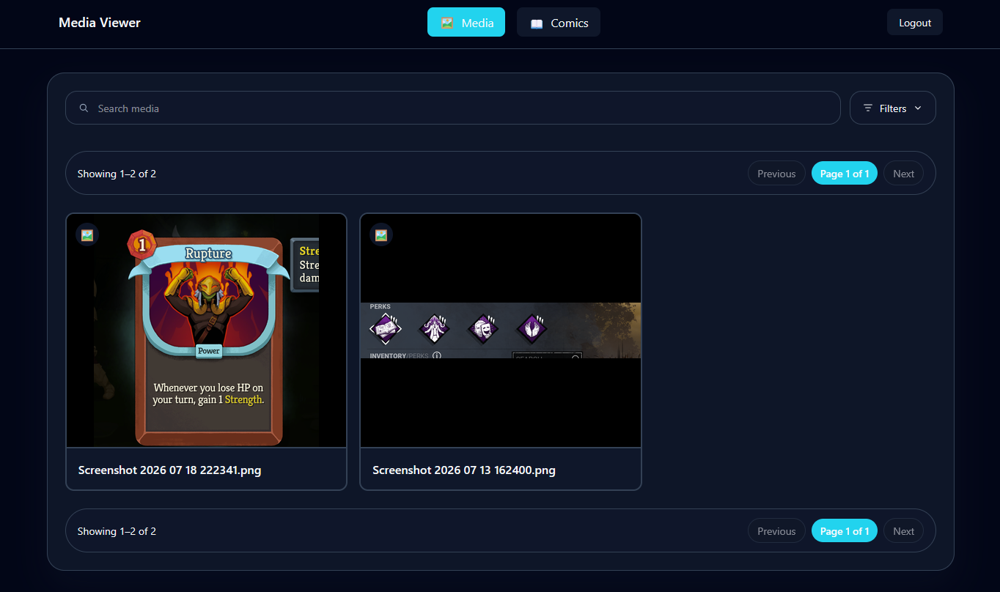
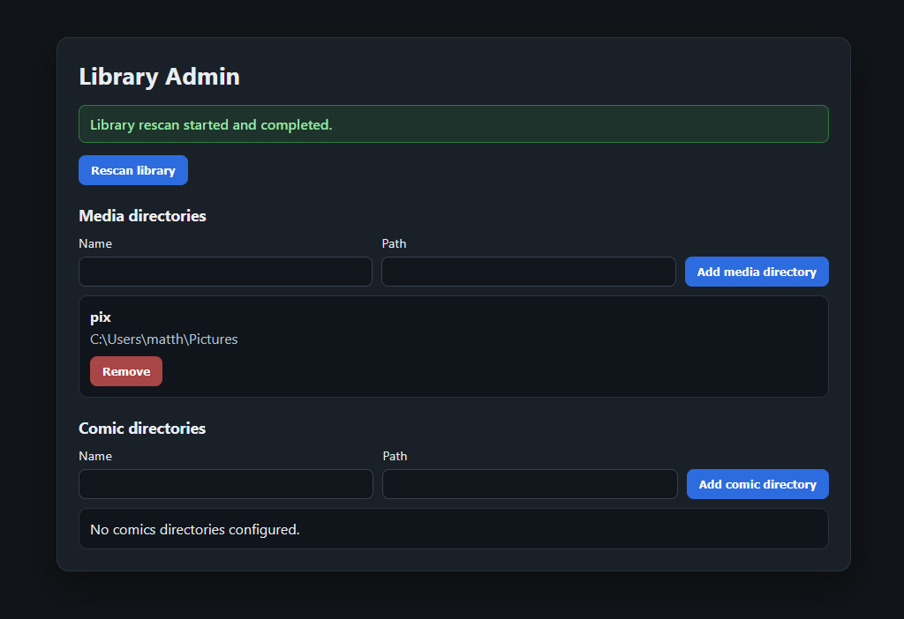

# media-viewer

Stream your media library and comic library to devices on your home network.

## App Views

### Main Viewer


### Admin Page


## What You Need

- Node.js 18+
- A computer on your home network to host the app
- Media folders and optional comic folders you want to share

## One-Time Setup

### 1. Install dependencies

Run these from the project root:

```bash
cd api
npm install

cd ../ui
npm install
```

### 2. Create HTTPS certificates

The API requires these files:

- api/certs/cert.pem
- api/certs/key.pem

Use mkcert to generate them for localhost and your local IP.

Windows:

```powershell
winget install FiloSottile.mkcert
mkcert -install
mkcert localhost 127.0.0.1 <your-local-ip>
mkdir api\certs -Force
move localhost+2.pem api\certs\cert.pem -Force
move localhost+2-key.pem api\certs\key.pem -Force
```

macOS/Linux:

```bash
brew install mkcert
mkcert -install
mkcert localhost 127.0.0.1 <your-local-ip>
mkdir -p api/certs
mv localhost+2.pem api/certs/cert.pem
mv localhost+2-key.pem api/certs/key.pem
```

### 3. Configure api/.env

```env
PORT=3000
HOST=localhost

DATABASE_PATH=library.db
CACHE_PATH=cache

MEDIA_ROOTS=[{"name":"My Media","path":"C:\\Path\\To\\Media"}]
CBZ_ROOTS=[{"name":"My Comics","path":"C:\\Path\\To\\Comics"}]

AUTH_USER=admin
AUTH_PASS=your-password
AUTH_SECRET=change-this-to-a-random-secret
```

Notes:

- Use HOST=0.0.0.0 if you want other devices to connect directly to the API host.
- Directory changes made in the admin page are saved in cache/roots.json.

## Start The App

In terminal 1, from the root of the project repo:

```bash
cd api
npm run dev
```

In terminal 2, from the root of the project repo:

```bash
cd ui
npm run host
```

## View it On Your Network

1. On another device, open a browser.
2. Go to https://<your-local-ip>:5173.
3. Log in with AUTH_USER and AUTH_PASS from api/.env.

If you see a certificate warning, trust your mkcert certificate authority on that device.

## Features

- Video and image browsing
- CBZ comic browsing
- Search and filters
- Auth-protected admin page for rescan and directory management

## Security

- Home network use only
- Use a strong AUTH_PASS
- Use a long random AUTH_SECRET
